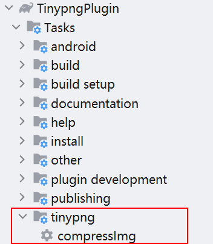

# 使用方式

## 1. 使用jitpack中的插件

### 1. 添加依赖

settings.gradle中添加 jitpack仓库
```groovy
pluginManagement {
    repositories {
        // ...
        maven { url 'https://jitpack.io' }
        google()
        mavenCentral()
        gradlePluginPortal()
    }
}
```

在project的build.gradle中添加插件依赖
```groovy
buildscript {
    dependencies {
        classpath 'com.github.aidaole:TinypngPlugin:1.0.0'
    }
}
```

### 2. 配置插件

在app的build.gradle中配置插件

```groovy
apply plugin: "com.aidaole.plugin.tinypng"
tinypngConfig {
    apiKey "xxxxxxxxxxxx" // tinypng官网申请
    imgTypes ".png|.jpg" // 可选
}
```

sync项目之后可以看到对应的图片压缩task




## 2. 或者自己发布插件到本地

此插件没有上传到公共仓库，如果要使用可以直接本地发布然后引用插件

1. 引入 `tinypng_plugin` module, 然后 sync project
2. 执行 `tinypng_plugin` 模块下的 `publishMavenPublicationToMavenRepository` 任务，会在projet目录下生成 `repo` 文件夹，里面包含了插件
3. 引入插件

project 的 build.gradle 引入插件

```gradle
buildscript {
    repositories {
        maven { url './repo' }
        dependencies { classpath 'com.aidaole.plugin:tinypng:1.0' }
    }
}
```

app 的 build.gradle 应用插件

```gradle
apply plugin: "com.aidaole.plugin.tinypng"
tinypngConfig {
    apiKey "xxxxxxxxxxxx" // tinypng官网申请
    imgTypes ".png|.jpg" // 可选
}
```

4. 然后sync项目，在 gradle 任务列表中可以看到 com.aidaole.plugin 下的 `compressImg` task， 直接运行task即可

